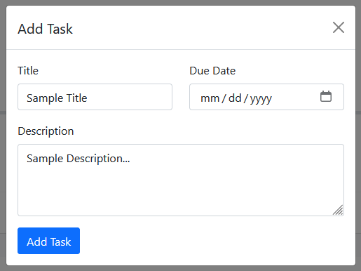

# todo-task-board

## Description

Description...

```md
TODO-task-board
├── Assets
│   ├── css
│   │   └── styles.css
│   └── js
│       └── script.js
├── index.html
└── README.md
```

## Features

-
-
-
-

## Mock-Up

The *title* can be viewed at: https://josefalcongh.github.io/ *link*

### Add Task Form

Pop-up form for adding tasks to the task board.



## Learning Outcomes

-
-
-
-

## Usage

1.
2.
3.
4.

## License

This project is licensed under the MIT License.